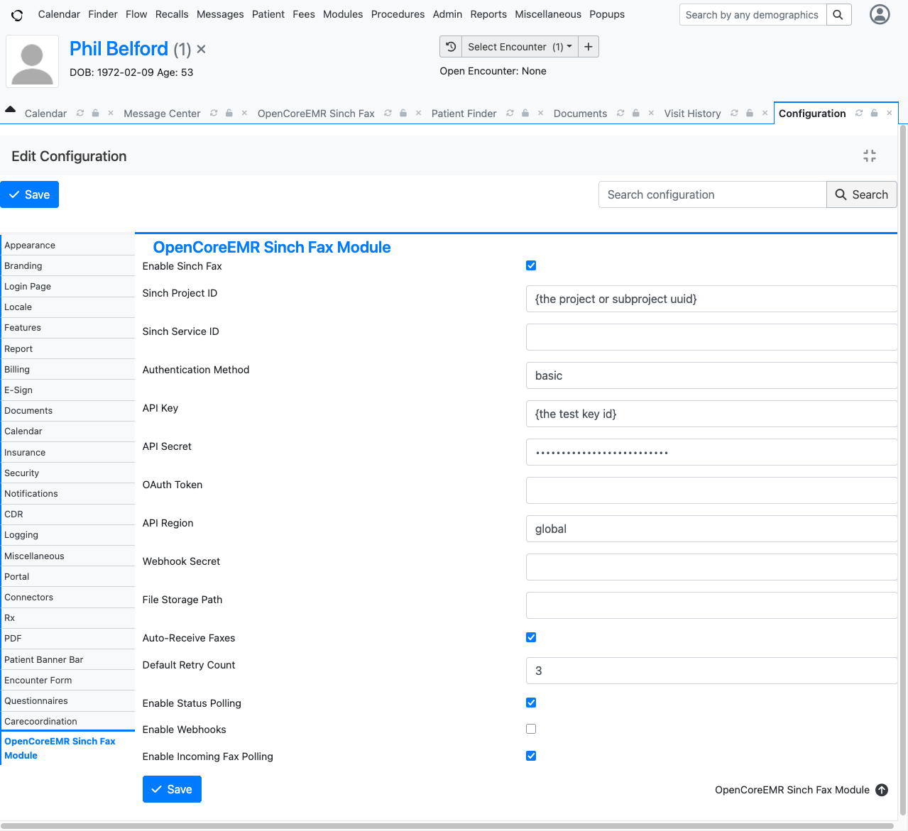
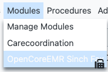
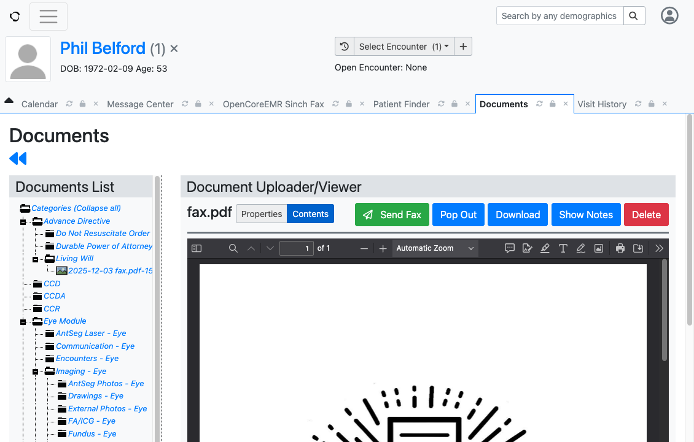
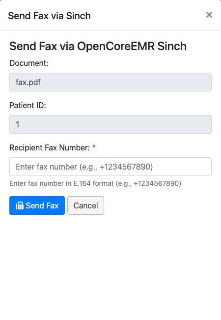
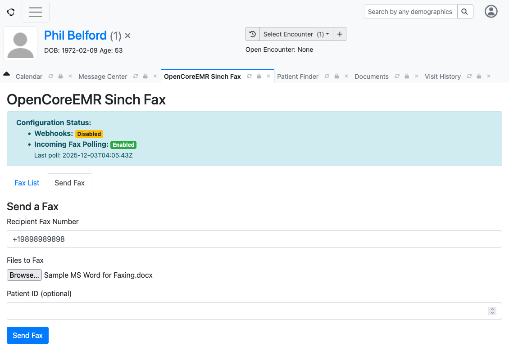
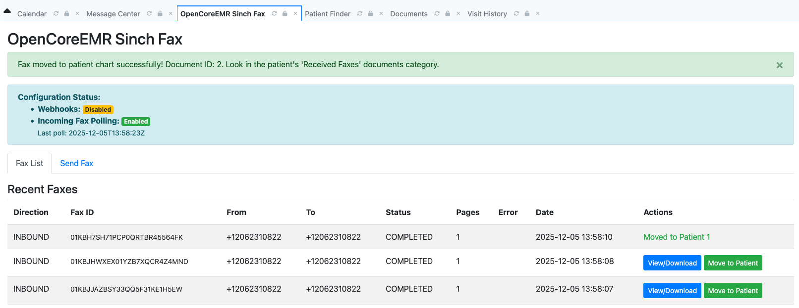
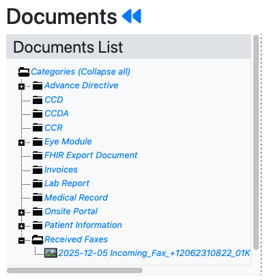
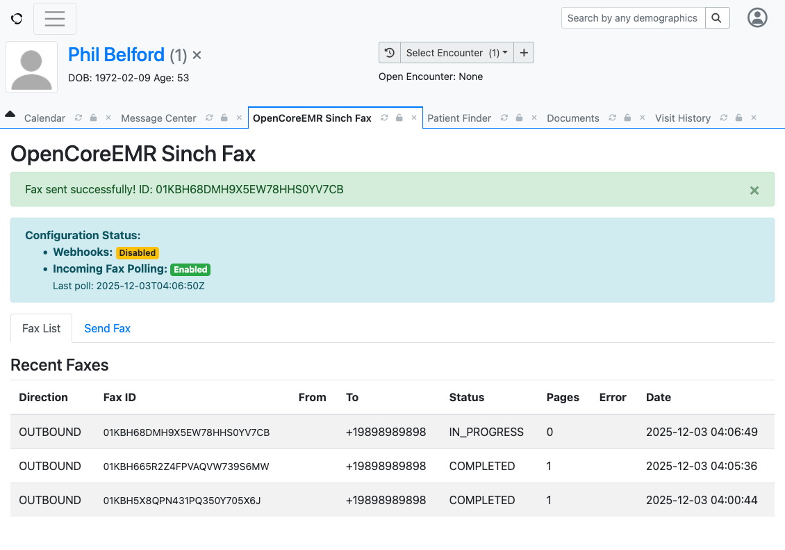

# OpenEMR Sinch Fax Module

A secure fax integration module for OpenEMR using the Sinch Fax API.

## Features

- **Send Faxes**: Send faxes to one or multiple recipients
- **Multiple File Formats**: Support for PDF, TIFF, PNG, JPEG, DOC, and DOCX
- **Security**: Encrypted storage of API credentials, secure file handling
- **Patient Integration**: Link faxes to patient records
- **Audit Trail**: Complete tracking of all fax activity

## Requirements

- OpenEMR 7.0.0 or later
- PHP 8.2 or later
- MySQL 5.7 or later / MariaDB 10.2 or later
- Sinch Fax account with API credentials

## Installation

### Via Composer (Recommended)

1. Navigate to your OpenEMR installation directory
2. Install the module via Composer:
   ```bash
   composer require opencoreemr/oce-module-sinch-fax
   ```

3. Log into OpenEMR as an administrator
4. Navigate to **Administration > Modules > Manage Modules**
5. Find "OpenCoreEMR Sinch Fax" in the list and click **Register**
6. Click **Install**
7. Click **Enable**

### Manual Installation

1. Download the latest release
2. Extract to `interface/modules/custom_modules/oce-module-sinch-fax` (relative to your OpenEMR root directory)
3. Follow steps 3-7 from the Composer installation

## Configuration

1. Navigate to **Administration > Globals > OpenCoreEMR Sinch Fax Module**
2. Configure the following settings:
   - **Sinch Project ID**: Your Sinch project ID
   - **Sinch Service ID**: Your Sinch service ID (optional)
   - **API Authentication**: Choose Basic Auth or OAuth2
   - **API Key/Secret**: Your Sinch API credentials
   - **API Region**: Select your preferred region (or leave as 'global')

3. Save the settings



## Usage

### Accessing the Module

Once installed and configured, you can access the module from the **Modules** menu:



### Sending a Fax

The module supports the following file formats: **PDF, TIFF, PNG, JPEG, DOC, and DOCX**.

#### From Patient Documents (Recommended)

In real-world usage, you'll typically send faxes directly from a patient's document:

1. Navigate to a patient's **Documents** tab
2. Select the document you want to fax
3. Click the **Send Fax** button in the document viewer toolbar



4. In the Send Fax dialog, the document and patient are already pre-filled
5. Enter the recipient fax number in E.164 format (e.g., +12345678901)
6. Click **Send Fax**



#### From the Module Interface

Alternatively, you can upload and send files directly:

1. Navigate to **Modules > OpenCoreEMR Sinch Fax**
2. Click the **Send Fax** tab
3. Enter the recipient fax number(s)
4. Select or upload the file(s) to fax
5. Optionally link to a patient record
6. Click **Send Fax**



Upon successful submission, you'll receive a fax ID that can be used to track the fax in progress.

> **Note:** The screenshots show demo data. Patient information displayed is for demonstration purposes only, and `+19898989898` is Sinch's demo fax number for testing.

### Receiving Faxes

Incoming faxes are automatically received via webhook and stored in the module:

1. Navigate to **Modules > OpenCoreEMR Sinch Fax**
2. Click the **Fax List** tab to view all received faxes
3. Locate the received fax you want to assign to a patient
4. Click the **Move to Patient** button
5. Select the patient to associate the fax with



Once moved to a patient, the fax will:
- Appear in the patient's **Documents** tab under the **Received Faxes** category
- Remain visible in the Fax List but marked as **"Moved to Patient X"** in the Actions column
- Be managed like any other patient document in the patient's chart



### Viewing Faxes

1. Navigate to **Modules > OpenCoreEMR Sinch Fax**
2. Click the **Fax List** tab to view all sent and received faxes
3. The list shows direction, fax ID, recipient/sender, status, pages, and timestamp

**Fax States:**
- **Unread** - New inbound faxes (highlighted with bold text)
- **Read** - Viewed faxes (outbound faxes default to read)
- **Archived** - Hidden from default view

**Filtering:**
- Filter by direction (Inbound/Outbound)
- Toggle "Show Archived" to include archived faxes

**Bulk Actions:**
- Select multiple faxes using checkboxes
- Mark as Read, Mark as Unread, or Archive in bulk

**Automatic Actions:**
- Faxes are automatically marked as read when downloaded/viewed
- Reconciliation runs on page load to detect any faxes missed by webhooks



## Security

- API credentials are encrypted in the database
- Fax files are stored with restricted permissions
- All file uploads are validated
- Audit logging for all fax operations

## Support

- Email: support@opencoreemr.com
- Issues: https://github.com/opencoreemr/oce-module-sinch-fax/issues

## License

GNU General Public License v3.0 or later

## Credits

Developed by OpenCoreEMR Inc
